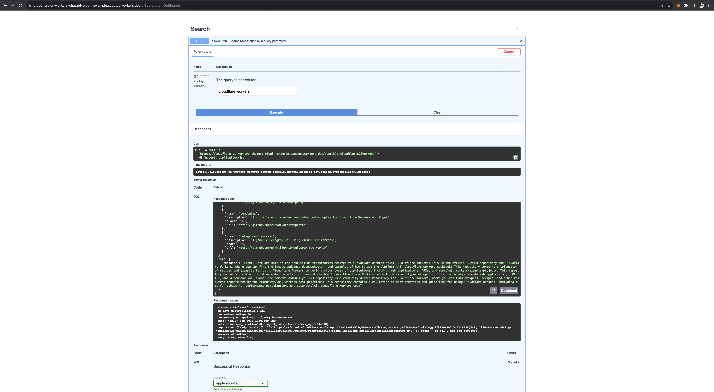

# ChatGPT Plugins on Cloudflare

This repo contains Cloudflare's work with ChatGPT plugins. The plugins are built using the [Cloudflare Workers](https://workers.cloudflare.com/) platform.

- [`example-plugin`](https://github.com/cloudflare/chatgpt-plugin/tree/main/example-plugin): An example plugin that can be deployed to Cloudflare Workers in 5 minutes, allowing search and retrieval of GitHub repositories.
- [`example-weather-plugin`](https://github.com/cloudflare/chatgpt-plugin/tree/main/example-weather-plugin): An example plugin that retrieves weather information from the [Pirate Weather API](https://pirate-weather.apiable.io/).

## Extended example by @cagataycali

In this version of ChatGPT plugin template, we're experimenting Cloudflare AI solution on workers.

## Output:

Screenshot from Swagger interface.



## Additions:

`./example-plugin` modified.


## How To Use:

```bash
cd example-plugin;
wrangler deploy; # npm i -g wrangler
```

## Demo:

Check out the demo:
[https://cloudflare-ai-workers-chatgpt-plugin-example.cagatay.workers.dev](https://cloudflare-ai-workers-chatgpt-plugin-example.cagatay.workers.dev)


```typescript
async handle(request: Request, env, ctx, data: Record<string, any>) {
    // Initiate the AI
    const ai = new Ai(env.AI)

    const url = `https://api.github.com/search/repositories?q=${data.q}`

    const resp = await fetch(url, {
      headers: {
        'Accept': 'application/vnd.github.v3+json',
        'User-Agent': 'RepoAI - Cloudflare Workers ChatGPT Plugin Example'
      }
    })

    if (!resp.ok) {
      return new Response(await resp.text(), { status: 400 })
    }

    const json = await resp.json()

    // @ts-ignore
    const repos = json.items.map((item: any) => ({
      name: item.name,
      description: item.description,
      stars: item.stargazers_count,
      url: item.html_url
    }))
    // Generate a response with Cloudflare AI:
    const messages = [
      { role: 'system', content: "I'm going to help you to find the best GitHub repository based on your search." },
      { role: 'user', content: 'My search is: ' + data.q },
    ];
    const response = await ai.run('@cf/meta/llama-2-7b-chat-int8', { messages });

    return {
      repos: repos,
      ai: response
    }
  }
```